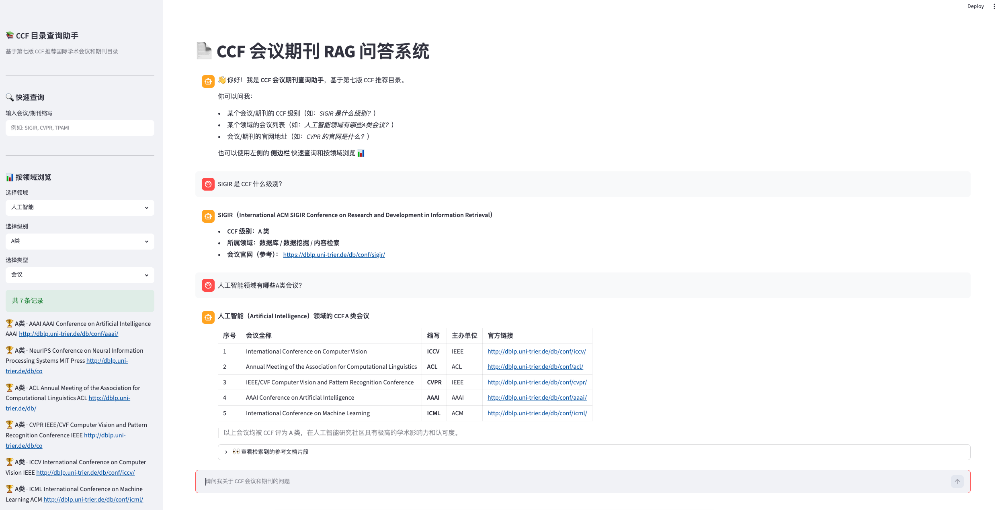

# 📚 CCF 会议期刊 RAG 问答系统

> 基于 LangChain + ChromaDB + Streamlit 构建的 RAG 知识库问答系统，可快速查询第七版 CCF 推荐国际学术会议和期刊目录。

## ✨ 功能亮点

- 🔍 **智能问答**：基于 RAG（检索增强生成）技术，输入自然语言即可查询 CCF 会议/期刊的级别、领域、官网等信息
- 📊 **结构化浏览**：侧边栏支持按领域、级别、类型快捷筛选，一键查看所有会议/期刊
- 💬 **多轮对话**：支持上下文追问（如先问"A类会议有哪些？"再追问"第一个的官网是什么？"）
- ⚡ **流式输出**：打字机效果，实时显示回答
- 🧠 **意图路由**：自动识别闲聊 vs 专业查询，闲聊秒回，专业问题走 RAG 检索
- 📝 **数据准确**：基于官方第七版 CCF 目录 PDF，不依赖网络搜索，数据来源唯一且权威



## 🏗️ 技术架构

```
用户输入
  ↓
意图分类器 (关键词匹配)
  ↓
┌──────────────┐    ┌──────────────┐
│ 闲聊 → 直接  │    │ 专业查询 →   │
│ 调用大模型回复│    │ 向量检索+RAG │
└──────────────┘    └──────────────┘
                          ↓
                    ChromaDB 向量库
                    (681 条结构化记录)
                          ↓
                    大模型生成回答
                    (流式输出)
```

**核心技术栈：**

| 组件 | 技术 | 作用 |
|------|------|------|
| 文档解析 | PyPDFLoader + 状态机 | 从 PDF 表格中提取结构化数据，恢复跨页丢失的上下文 |
| 文本向量化 | text2vec-base-chinese | 中文友好的开源 Embedding 模型 |
| 向量数据库 | ChromaDB | 本地持久化存储，支持 Metadata 过滤检索 |
| 大模型调用 | LangChain + OpenAI 兼容 API | LCEL 管道编排，支持流式输出 |
| 前端界面 | Streamlit | 聊天界面 + 侧边栏筛选器 |

## 🚀 快速开始

### 1. 克隆项目
```bash
git clone https://github.com/your-username/rag-ccf.git
cd rag-ccf
```

### 2. 创建虚拟环境并安装依赖
```bash
python3 -m venv venv
source venv/bin/activate  # Windows: venv\Scripts\activate
pip install -r requirements.txt
```

### 3. 配置 API Key
```bash
cp .env.example .env
# 编辑 .env 文件，填入你的 API Key
```

### 4. 构建向量数据库
```bash
python ingest.py
```

### 5. 启动应用
```bash
streamlit run app.py
```

打开浏览器访问 `http://localhost:8501` 即可使用。

## 📁 项目结构

```
rag-ccf/
├── app.py              # Streamlit 主应用（聊天界面 + 侧边栏）
├── ingest.py           # PDF 解析 & 向量库构建脚本
├── requirements.txt    # Python 依赖
├── .env.example        # 环境变量模板
├── .gitignore          # Git 忽略规则
├── chroma_db/          # ChromaDB 向量数据库（本地生成）
└── 第七版...pdf        # CCF 推荐目录 PDF 原始文件
```

## 🔧 技术亮点（适合面试讲解）

1. **状态机文档预处理**：CCF 目录是表格型 PDF，直接切块会丢失"A 类"/"人工智能"等跨页表头信息。通过自定义状态机逐行扫描，自动追踪并恢复每条记录的完整上下文。

2. **意图路由（Intent Router）**：将用户输入分为"闲聊"和"专业查询"两条链路。闲聊跳过向量检索直接回复（毫秒级），专业查询走完整 RAG 流程，兼顾速度和准确性。

3. **Metadata 结构化检索**：为每条记录附加 `category`、`pub_type`、`ccf_level`、`abbreviation` 等元数据，支持 ChromaDB 的精确过滤，而不仅仅依赖语义相似度。

4. **Prompt Engineering**：通过角色扮演（"你把 CCF 目录背下来了"）和行为约束（禁止暴露 RAG 机制），让回答更自然、更专业。
